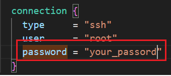
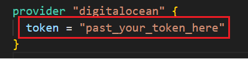
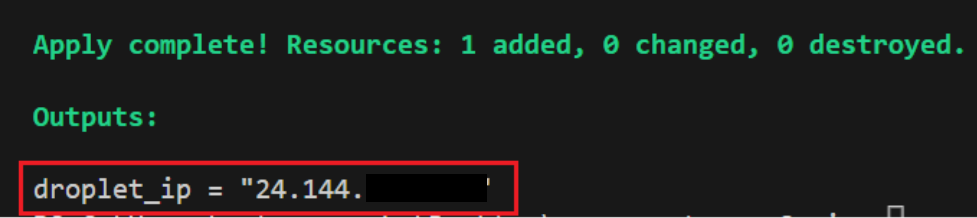

<h1 align="center">
<a href="icon"></a>
</h1>

<p align="center">
  <a href="#password-and-token"> 1 - Configure Password and Token</a> •
  <a href="#create-vps">2 - Create VPS</a> •
  <a href="#install-go">3 - Access VPS and Install GO</a> •
  <a href="#running-template">4 - Running Template</a>
</p>

---

For a successful use of the `Recon Template`, it is extremely important that you correctly follow the steps described in the Menu above.

## Password And Token

1. Open the file `main.tf` and search *password* variable:



Between the " " keys, write the desired password for your VPS.

<table>
<tr>
<td>  

> **Observation**:
> **The Password must follow the criteria below:**
> - Must be at least 8 characters long
> - Must contain 1 uppercase letter (cannot be first or last character)
> - Must contain 1 number
> - Cannot end in a number or special character

</table>
</tr>
</td> 

2. Get your Personal Token on Digital Ocean panel:

Follow **[HERE](https://docs.digitalocean.com/reference/api/create-personal-access-token/)** the instructions from the official Digital Ocean page to create your token!

3. On file `main.tf`,  search *token* variable:




## Create VPS

1. Open CMD on folder of Recon Template.

2. execute this command for terraform init project setup:

```sh
terraform init
```

3. after, execute this other command:

```sh
terraform plan
```


4. after, execute this final command:

```sh
terraform apply -auto-approve
```

5. save your ipv4 that was displayed on the console after creating the VPS.



# Install GO


1. Access your VPS with Password and Public Ipv4:

Open Visual Studio Code, and open the terminal.

2. past the command with your ipv4:

```sh
ssh @your_ipv4
```

3. Wait as they will ask for your password, enter the same one you put in the file `main.tf`.

4. when connect on VPS, execute this command for download of Go:

```sh
wget https://go.dev/dl/go1.20.6.linux-amd64.tar.gz
```

5. when success on Go download, execute this command:

```sh
rm -rf /usr/local/go && tar -C /usr/local -xzf go1.20.6.linux-amd64.tar.gz
```

6. after, execute this other command to export Go Path:

```sh
export PATH=$PATH:/usr/local/go/bin
```

7. verify success on Go install:

```sh
go version
```


# Running Template
Click **[HERE](https://github.com/cunhaDev/go-tools)** for install Tools on your VPS!

